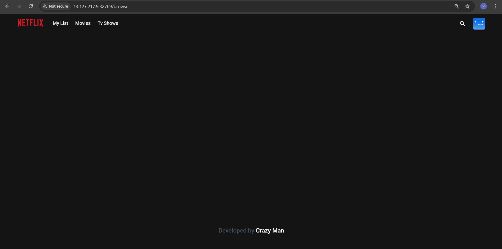
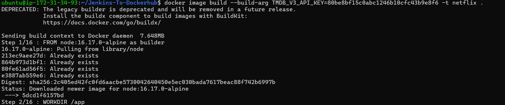
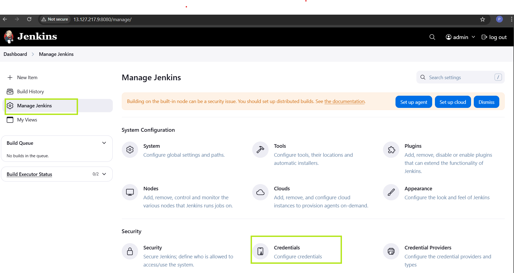
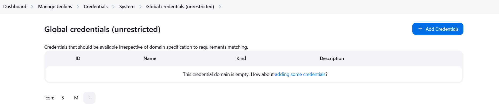
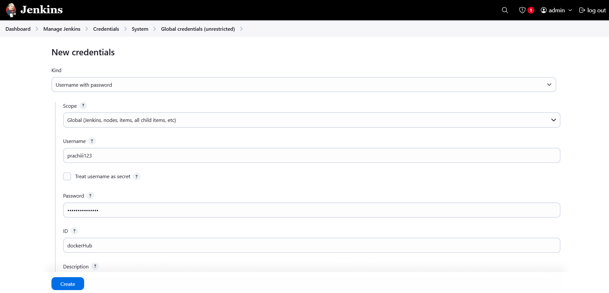
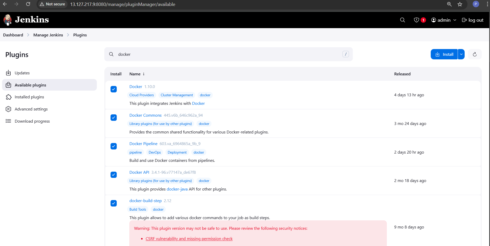
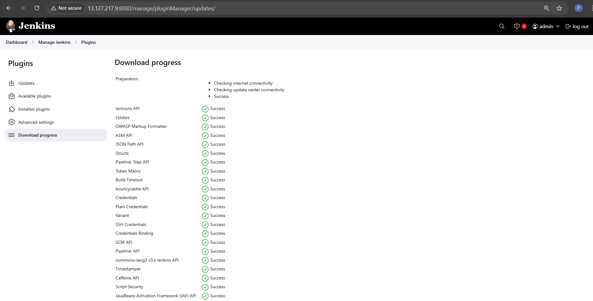
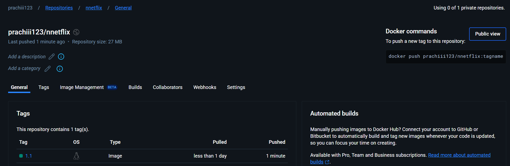
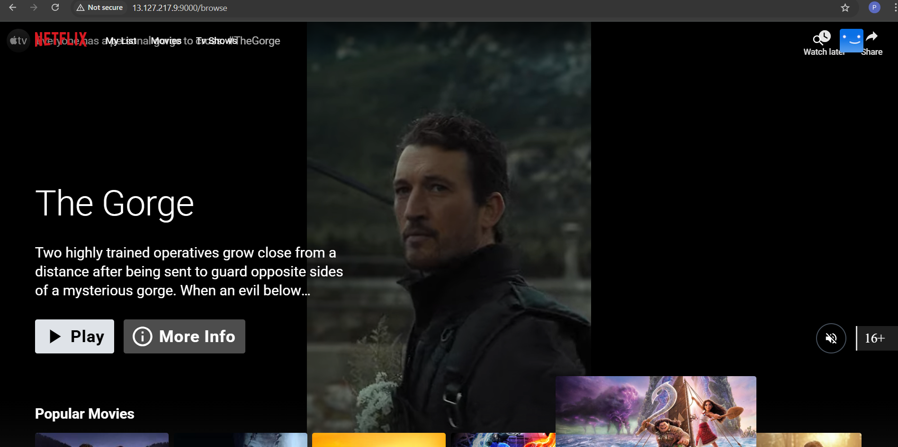

# **Automated Docker Image Build & Push with Jenkins** 🚀

## **Project Overview**
This project sets up a **Jenkins CI/CD pipeline** to **automate the building and pushing of Docker images** to Docker Hub.

## **Prerequisites**
Ensure you have the following installed on your **Jenkins server**:

- **Jenkins** (latest version)
- **Docker**
- **Git**
- A **Docker Hub account**
- A **GitHub repository** for the project
- A **Nodejs-16** and Yarn 

---

## **Step 1: Install Docker on Jenkins Server**
Run the following commands on your **Jenkins server**:
```sh
sudo apt update && sudo apt install docker.io -y
sudo usermod -aG docker jenkins  # Allow Jenkins to use Docker
sudo systemctl restart docker
```
## **Step 2: Install Node js nd npm on local machine or virtual machine**
```bash
  curl -fsSL https://deb.nodesource.com/setup_16.x | sudo -E bash -
  sudo apt-get install -y nodejs
  node -v
  npm -v
  sudo  npm install --global yarn
  yarn install
```
---
## **Step 3 : Build and Image locally to check whether is building or Not **
```bash
    docker image build -t  netflix .
```
  1. It will give you an blank Netflx page with no Images on it

  

  2. To solve that you have create an **API** key in <b>TMBD</b>
---
### 🔹 Step-by-Step Guide

#### **1️⃣ Sign Up or Log In**
1. Go to **[TMDB Website](https://www.themoviedb.org/)**.
2. Click on **Sign Up** (if you don’t have an account) or **Log In**.

#### **2️⃣ Navigate to API Section**
1. After logging in, click on your **profile icon** (top-right corner).
2. Select **Settings** from the dropdown.
3. In the left sidebar, click on **API**.

#### **3️⃣ Request an API Key**
1. Click on **Create API Key**.
2. Select the **purpose**:
   - Personal project
   - Commercial use
   - Educational use
   - Other
3. Fill in the required details.
4. Accept the terms and conditions.
5. Click **Submit**.

#### **4️⃣ Get Your API Key**
- Once approved, your **API Key (v3 auth)** will be displayed.
  Now you can build your docker image by using follwing command

```bash
docker image build -t --build-arg  TMDB_V3_API_KEY=80be8bf15c0abc1246b10cfc43b9e8f6 -t netflix .
```
 
---

## **Step 4: Configure Docker Hub Credentials in Jenkins**
1. Go to **Jenkins Dashboard** → **Manage Jenkins** → **Manage Credentials**


2. Under **Global Credentials**, click **Add Credentials**


3. Select **Username and Password** and enter:
   - **Username:** *Your Docker Hub username*
   - **Password:** *Your Docker Hub password*
4. Set **ID** as `dockerHub` and save.


---
## **Step 4: Install some Plugins in Jenkins for Docker **

### **Step-by-Step Guide**

1. Open **Jenkins Dashboard**.
2. Click on **Manage Jenkins**.
3. Navigate to **Manage Plugins**.
4. Select the **Available** tab.
5. Use the **Search Bar** to find the required plugins one by one:
    

   - **Docker**
   - **Docker commons**
   - **Docker pipeline**
   - **DOcker API**
   - **DOcker Build and Push**
6. Check the box next to each plugin.
7. Click **Install Without Restart**.
   
8. Wait for the installation to complete.
9. Restart Jenkins if required.

🚀 Now, Jenkins is ready for Docker build and push operations! 🎯

## **Step 5 : Add and docker tool 
 1. Open **Jenkins Dashboard**.
2. Click on **Manage Jenkins**.
3. Navigate to **tools**
4.  Select the **Docker** tab.
5. Click on it and install it.

## **Step 4: Create a Jenkins Pipeline (Jenkinsfile)**
Inside your **GitHub repository**, create a file named `Jenkinsfile` with the following content:

```groovy
pipeline {
    agent any

    environment {
        DOCKER_IMAGE = "your-dockerhub-username/your-image-name"
        DOCKER_CREDENTIALS_ID = "dockerhub-credentials"
    }

    stages {
        stage('Clone Repository') {
            steps {
                git 'https://github.com/your-repo.git'  // Replace with your actual repo
            }
        }

        stage('Build Docker Image') {
            steps {
                script {
                    sh "docker build -t ${DOCKER_IMAGE}:latest ."
                }
            }
        }

        stage('Login to Docker Hub') {
            steps {
                script {
                    withCredentials([usernamePassword(credentialsId: DOCKER_CREDENTIALS_ID, usernameVariable: 'DOCKER_USER', passwordVariable: 'DOCKER_PASS')]) {
                        sh "echo $DOCKER_PASS | docker login -u $DOCKER_USER --password-stdin"
                    }
                }
            }
        }

        stage('Push Image to Docker Hub') {
            steps {
                script {
                    sh "docker push ${DOCKER_IMAGE}:latest"
                }
            }
        }
    }
}
```

---

## **Step 5: Create a Jenkins Job**
1. Go to **Jenkins Dashboard** → Click **New Item** → Select **Pipeline**
2. Under **Pipeline Definition**, choose **Pipeline script from SCM**
3. Set **SCM** to **Git** and enter your **GitHub repo URL**
4. Click **Save**, then **Build Now**

---

## **Step 6: Verify the Docker Image on Docker Hub**
Once the pipeline runs successfully:
1. Go to **Docker Hub** → Navigate to your repository
2. You should see the newly pushed Docker image 🎉
   

---

## **Bonus: Tagging the Image with Git Commit SHA**
Modify the **Push Image** stage in `Jenkinsfile` to tag images with the Git commit SHA:

```groovy
sh "docker tag ${DOCKER_IMAGE}:latest ${DOCKER_IMAGE}:${GIT_COMMIT}"
sh "docker push ${DOCKER_IMAGE}:${GIT_COMMIT}"
```

### To see whether the container is running or Not

  1. Go to web-browser and type `http:<public-ip-address>:9000`
  2. Youll be directed to the Website as follows

  3. 

## **Conclusion**
This project demonstrates how to automate Docker image **builds and pushes** using **Jenkins pipelines**, improving **DevOps workflows**! 🚀

Happy Learning! 😊
